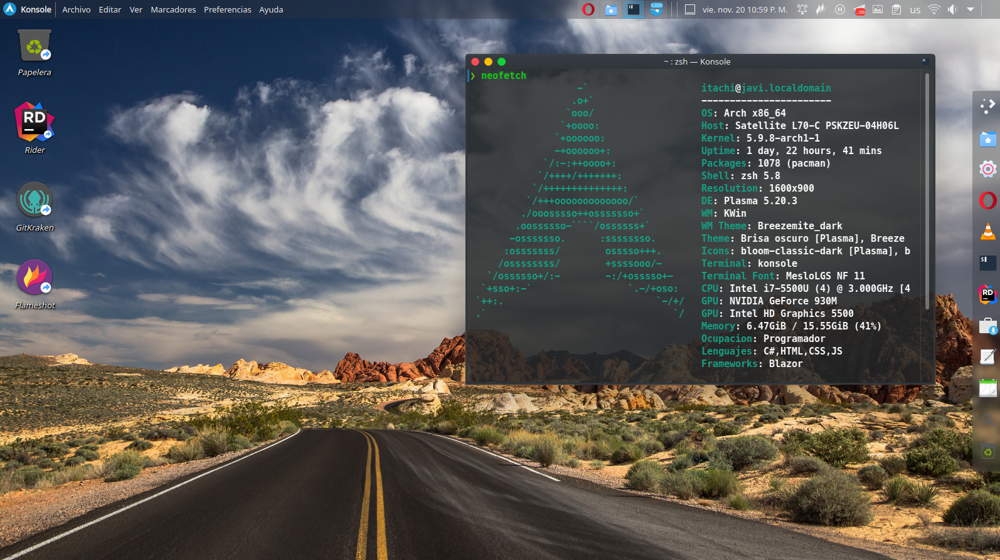

### Console.WriteLine("Hey, I'm Abdiel and I develop software");👋

- 🌱 I'm currently learning everything 🤣
- 🥅 Goals for 2020: Improve my skills
- ⚡ Fun fact: I like to read manga, manhua and manhwa / listen to music and ride a bike

### Methods to invoke me()
### {
 

### }
 

<h3 align="left">Languages and Tools:</h3>

        <a href="https://www.sqlite.org/" target="_blank"> 
<code></code>
<code></code>  
  
### Stats and favorite repositories

&nbsp;

### Used operating systems

[telegram]: https://t.me/Orauis
[whatsapp]: https://wa.me/qr/7FZK25UY3ZMJL1
[twitter]: https://twitter.com/Javixo13?s=09

